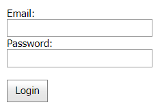

<!-- default badges list -->

<!-- default badges end -->
# Callback Panel for ASP.NET Web Forms - How to redirect a user on a callback
<!-- run online -->
**[[Run Online]](https://codecentral.devexpress.com/t228312/)**
<!-- run online end -->
This example demonstrates how to redirect users during the [Callback Panel](https://docs.devexpress.com/AspNet/8277/components/multi-use-site-controls/callback-panel?p=netframework) control's callback.

In the example, the callback panel displays a **Login** button and text boxes for an email address and password. The panel sends a callback to the server once you click the button. On the server, the [ValidateEditorsInContainer](https://docs.devexpress.com/AspNet/DevExpress.Web.ASPxEdit.ValidateEditorsInContainer(System.Web.UI.Control)?p=netframework) method validates text box values. If they pass validation, the [RedirectOnCallback](https://docs.devexpress.com/AspNet/DevExpress.Web.ASPxWebControl.RedirectOnCallback(System.String)?p=netframework) method redirects you to the *Login.aspx* page. If validation fails, one or more error messages appear in the [Validation Summary](https://docs.devexpress.com/AspNet/11626/components/data-editors/validationsummary?p=netframework) control above the text boxes.

## Files to Review

* [Default.aspx](./CS/Default.aspx) (VB: [Default.aspx](./VB/Default.aspx))
* [Default.aspx.cs](./CS/Default.aspx.cs) (VB: [Default.aspx.vb](./VB/Default.aspx.vb))
* [Login.aspx](./CS/Login.aspx) (VB: [Login.aspx](./VB/Login.aspx))
* [Login.aspx.cs](./CS/Login.aspx.cs) (VB: [Login.aspx.vb](./VB/Login.aspx.vb))

## Documentation

* [Callbacks](https://docs.devexpress.com/AspNet/402559/common-concepts/callbacks?p=netframework)
